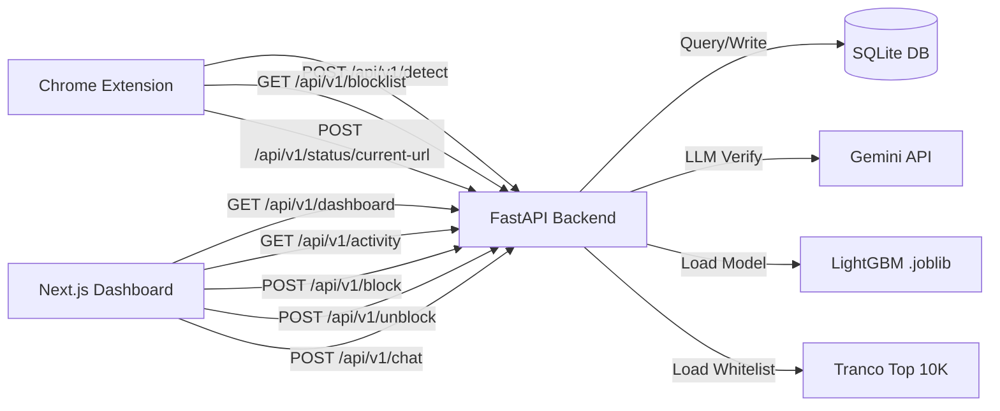
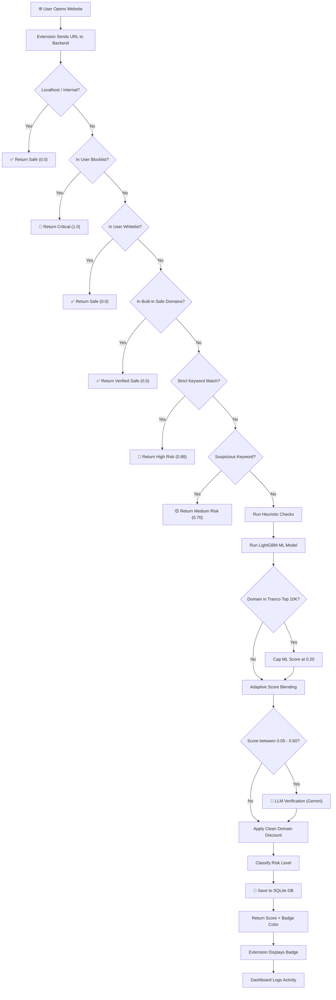
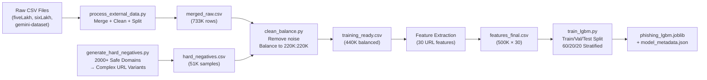
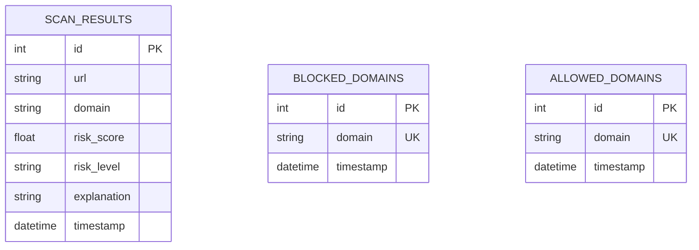

<p align="center">
  
  
  
  
  
  
</p>

<h1 align="center">🛡️ SecureSentinel</h1>
<h3 align="center">Autonomous AI-Powered Defense Against Phishing & Social Engineering</h3>

<p align="center">
  <i>A multi-layered real-time security platform combining Machine Learning, Heuristic Analysis, LLM Verification, and Behavioral Monitoring to protect users from phishing, social engineering, and malicious websites.</i>
</p>

---

## 📋 Table of Contents

- [Overview](#-overview)
- [Key Features](#-key-features)
- [System Architecture](#-system-architecture)
- [Detection Pipeline Flowchart](#-detection-pipeline-flowchart)
- [Project Structure](#-project-structure)
- [ML Model — Performance & Metrics](#-ml-model--performance--metrics)
- [Feature Engineering](#-feature-engineering)
- [Dataset & Data Pipeline](#-dataset--data-pipeline)
- [The 6 Defense Layers](#%EF%B8%8F-the-6-defense-layers)
- [API Reference](#-api-reference)
- [Database Schema](#%EF%B8%8F-database-schema)
- [Quick Start Guide](#-quick-start-guide)
- [Tech Stack](#-tech-stack)
- [Privacy & Security](#-privacy--security)
- [Troubleshooting](#-troubleshooting)
- [Future Roadmap](#-future-roadmap)
- [License](#-license)

---

## 🌐 Overview

SecureSentinel is a **full-stack AI security platform** that analyzes every website you visit in real-time and assigns a **Risk Score** from 0% (Safe) to 100% (Dangerous). The system operates across three integrated components:

| Component | Technology | Role |
|-----------|-----------|------|
| **Backend API** | FastAPI + LightGBM + Gemini LLM | ML inference, heuristic analysis, LLM verification |
| **Dashboard** | Next.js 16 + React 19 + TailwindCSS | Activity monitoring, threat analytics, AI assistant |
| **Browser Extension** | Chrome Extension (Manifest V3) | Real-time URL scanning, badge overlay, site blocking |

### Risk Scoring System

| Badge | Score Range | Meaning |
|-------|------------|---------|
| 🟢 **Green** | 0–40% | Safe to browse |
| 🟡 **Yellow** | 41–70% | Moderate risk — proceed with caution |
| 🔴 **Red** | 71–100% | High risk — site is dangerous / blocked |

---

## ✨ Key Features

### For End Users
- ✅ Real-time phishing detection badges on **search results** (Google, Brave, Bing)
- ✅ Automatic blocking of high-risk sites (≥75% risk score) with a custom block page
- ✅ Interactive risk popup on hover showing detailed threat analysis
- ✅ AI Data Loss Prevention (DLP) on AI chat platforms (ChatGPT, Gemini, Claude)
- ✅ DOM popup scanner for fake "virus detected" overlays
- ✅ Dialog interceptor for malicious `alert()`/`confirm()`/`prompt()` calls

### For Administrators
- ✅ Centralized dashboard with KPIs (total scans, threats blocked, safety score)
- ✅ 7-day activity trend charts
- ✅ Manual domain block/unblock with one click
- ✅ AI-powered chat assistant ("Sentinel AI") for security guidance
- ✅ Privacy settings (PII masking, data retention controls)

### For Developers
- ✅ REST API with full OpenAPI/Swagger documentation at `/docs`
- ✅ Extensible heuristic rules and keyword blacklists
- ✅ Multiple trained models (LightGBM, SGD, Enhanced Multi-Label)
- ✅ Model retraining pipeline with evaluation scripts

---

## 🏗 System Architecture

```
┌─────────────────────────────────────────────────────────────────────────────┐
│                          SecureSentinel Architecture                        │
├─────────────────────────────────────────────────────────────────────────────┤
│                                                                             │
│   ┌──────────────────────┐     HTTP/REST      ┌──────────────────────────┐  │
│   │   Chrome Extension   │ ◄─────────────────► │    FastAPI Backend       │  │
│   │   (Manifest V3)      │    Port 8002        │    (Python 3.10+)       │  │
│   │                      │                     │                          │  │
│   │  ┌────────────────┐  │                     │  ┌────────────────────┐  │  │
│   │  │ Service Worker  │  │                     │  │  LightGBM Model   │  │  │
│   │  │ (Background)    │  │  POST /api/v1/     │  │  (30 Features)     │  │  │
│   │  │  • URL Analysis │──│──  detect  ────────│──│  • 500K samples    │  │  │
│   │  │  • Cache (1hr)  │  │                     │  │  • AUC-ROC: 0.993 │  │  │
│   │  │  • Blocklist    │  │  GET /api/v1/      │  └────────────────────┘  │  │
│   │  │    Sync         │──│──  blocklist ──────│──┐                       │  │
│   │  └────────────────┘  │                     │  │ ┌──────────────────┐  │  │
│   │                      │                     │  │ │  Heuristic Engine│  │  │
│   │  ┌────────────────┐  │                     │  │ │  • IP Detection  │  │  │
│   │  │ Content Scripts │  │                     │  └─│  • URL Length    │  │  │
│   │  │  • Badge Inject │  │                     │    │  • Keyword Match │  │  │
│   │  │  • Risk Popup   │  │                     │    └──────────────────┘  │  │
│   │  │  • AI DLP       │  │                     │                          │  │
│   │  │  • Dialog Hook  │  │                     │  ┌──────────────────────┐│  │
│   │  │  • DOM Scanner  │  │                     │  │ Gemini LLM Service  ││  │
│   │  └────────────────┘  │                     │  │ (Ambiguous URL      ││  │
│   │                      │                     │  │  Verification)      ││  │
│   │  ┌────────────────┐  │                     │  └──────────────────────┘│  │
│   │  │ Popup UI       │  │                     │                          │  │
│   │  │  • Stats View  │  │                     │  ┌──────────────────────┐│  │
│   │  │  • Quick Block │  │                     │  │ SQLite Database     ││  │
│   │  └────────────────┘  │                     │  │  • scan_results     ││  │
│   └──────────────────────┘                     │  │  • blocked_domains  ││  │
│                                                │  │  • allowed_domains  ││  │
│   ┌──────────────────────┐     HTTP/REST       │  └──────────────────────┘│  │
│   │   Next.js Dashboard  │ ◄─────────────────► │                          │  │
│   │   (React 19 + TS)    │    Port 3000        └──────────────────────────┘  │
│   │                      │                                                   │
│   │  • KPI Dashboard     │                                                   │
│   │  • Activity Feed     │                                                   │
│   │  • Threat Map        │                                                   │
│   │  • AI Chat Assistant │                                                   │
│   │  • Block/Unblock UI  │                                                   │
│   │  • Privacy Settings  │                                                   │
│   └──────────────────────┘                                                   │
│                                                                              │
└──────────────────────────────────────────────────────────────────────────────┘
```

### Component Communication



---

## 🔄 Detection Pipeline Flowchart



### Score Blending Algorithm

The final confidence score is computed using an **adaptive blending** strategy:

| ML Score Range | ML Weight | Heuristic Weight | Rationale |
|---------------|-----------|-----------------|-----------|
| ≥ 0.95 | 90% | 10% | ML is very confident |
| 0.50 – 0.95 | 70% | 30% | Moderate ML confidence |
| < 0.50 | 50% | 50% | Low ML confidence, rely on both |

```
final_score = (ml_weight × ml_score) + ((1 - ml_weight) × heuristic_score)
```

Additionally, a **clean domain discount** (30–35% reduction) is applied to domains with legitimate TLDs (`.com`, `.org`, `.edu`, `.gov`) and reasonable structure (length 4–32 chars, ≤1 hyphen).

---

## 📁 Project Structure

```
SecureSentinel/
│
├── backend/                          # 🐍 FastAPI Server (AI Detection Engine)
│   ├── main.py                       #   Core API (990 lines) — all endpoints
│   ├── requirements.txt              #   Python dependencies
│   ├── app/
│   │   ├── database.py               #   SQLAlchemy + SQLite config
│   │   ├── models.py                 #   ORM models (ScanResult, BlockedDomain, AllowedDomain)
│   │   └── services/
│   │       ├── llm.py                #   Gemini LLM integration (URL analysis + chat)
│   │       ├── impersonation.py      #   Brand impersonation detection
│   │       ├── inference.py          #   ML inference service
│   │       ├── temporal.py           #   Temporal analysis (urgency detection)
│   │       └── telemetry.py          #   Telemetry data collection
│   └── sql_app.db                    #   SQLite database (gitignored)
│
├── my-app/                           # ⚛️ Next.js 16 Dashboard
│   ├── app/
│   │   ├── page.tsx                  #   Landing page (Hero + Features + ThreatMap)
│   │   ├── dashboard/                #   Main monitoring dashboard
│   │   ├── analyze/                  #   Manual URL analysis page
│   │   ├── blocked/                  #   Blocked domains management
│   │   ├── features/                 #   Feature showcase
│   │   ├── architecture/             #   Architecture documentation page
│   │   ├── how-it-works/             #   Technical explainer page
│   │   └── login/                    #   Authentication page
│   └── components/
│       ├── dashboard/                #   Activity charts, KPI cards
│       ├── ai/                       #   Sentinel AI chat assistant
│       ├── landing/                  #   Hero section, features, threat map
│       ├── features/                 #   Feature detail components
│       └── ui/                       #   Shared UI primitives (Radix UI)
│
├── extension-clean/                  # 🌐 Chrome Extension (Manifest V3)
│   ├── manifest.json                 #   Extension config (permissions, scripts)
│   ├── popup.html / popup.js         #   Extension popup UI
│   ├── blocked.html / blocked.js     #   Custom block page
│   └── src/
│       ├── background/
│       │   └── service-worker.js     #   URL analysis, caching, blocking logic
│       └── content/
│           ├── content.js            #   Badge injection on search results
│           ├── ai-dlp.js             #   PII detection on AI chat platforms
│           ├── dialog-interceptor.js  #  Alert/Confirm/Prompt monitoring
│           └── dom-popup-scanner.js  #   Fake overlay/scam popup detection
│
├── models/                           # 🧠 Trained ML Models
│   ├── phishing_lgbm.joblib          #   LightGBM classifier (6.8 MB) ← Primary
│   ├── model_metadata.json           #   Features list, threshold, metrics
│   ├── model_enhanced.joblib         #   SGD Multi-Label (33.5 MB) — social engineering
│   ├── model_scalable.joblib         #   SGD OneVsRest (643 KB)
│   ├── model_baseline.joblib         #   Baseline SGD (12.8 KB)
│   ├── vectorizer_*.joblib           #   Associated vectorizers
│   └── ...
│
├── ext_data/                         # 📊 Training Datasets (gitignored)
│   ├── features_final.csv            #   500K samples × 30 features (42 MB)
│   ├── training_ready.csv            #   440K balanced URL dataset (31 MB)
│   ├── hard_negatives.csv            #   51K safe-but-complex URLs (1.9 MB)
│   ├── tranco_10k.csv                #   Top 10K trusted domains (197 KB)
│   └── ...
│
├── scripts/                          # 🔧 Training & Data Pipeline
│   ├── train_enhanced.py             #   Multi-label SGD trainer (~1.1M samples)
│   ├── train_scalable.py             #   TF-IDF + SGD OneVsRest trainer
│   ├── train_baseline.py             #   Baseline model trainer
│   ├── generate_hard_negatives.py    #   Generates safe-but-complex URL samples
│   ├── process_external_data.py      #   Dataset consolidation + train/val/test split
│   └── ...
│
├── notebooks/                        # 📓 Jupyter Notebooks (EDA & Training)
│   ├── 01_explore_data.ipynb
│   ├── 02_preprocess.ipynb
│   ├── 03_train_model.ipynb
│   └── 04_evaluate.ipynb
│
├── train_lgbm.py                     # 🏋️ Primary LightGBM training script
├── eval_lgbm.py                      # 📏 Model evaluation script
├── start_server_v3.py                # 🚀 Server launcher (port 8002)
└── README.md                         # 📄 This file
```

---

## 📊 ML Model — Performance & Metrics

### Primary Model: LightGBM Classifier

The production model is a **LightGBM (Gradient Boosted Decision Trees)** classifier trained on **~500K URL samples** with 30 engineered features.

#### Training Configuration

| Parameter | Value |
|-----------|-------|
| Algorithm | `LGBMClassifier` |
| Estimators | 1,000 (with early stopping @ 50 rounds) |
| Learning Rate | 0.05 |
| Max Depth | 8 |
| Num Leaves | 63 |
| Min Child Samples | 50 |
| Feature Fraction | 0.8 (column subsampling) |
| Bagging Fraction | 0.8 (row subsampling) |
| Bagging Frequency | Every 5 iterations |
| L1 Regularization (λ₁) | 0.1 |
| L2 Regularization (λ₂) | 0.1 |
| Class Weight | Balanced |
| Train/Val/Test Split | 60% / 20% / 20% (stratified) |

#### Test Set Performance (n = 99,998)

| Metric | Class 0 (Benign) | Class 1 (Phishing) | Overall |
|--------|:----------------:|:-------------------:|:-------:|
| **Precision** | 0.96 | 0.97 | **0.97** |
| **Recall** | 0.97 | 0.96 | **0.97** |
| **F1-Score** | 0.97 | 0.97 | **0.97** |

| Aggregate Metric | Score |
|-----------------|:-----:|
| **AUC-ROC** | **0.9931** |
| **Weighted F1** | **0.9659** |
| **Accuracy** | **96.6%** |
| **Optimal Threshold** | **0.767** |

#### Confusion Matrix

```
                  Predicted
              Benign    Phishing
Actual  ┌──────────┬──────────┐
Benign  │  48,667  │   1,332  │
        ├──────────┼──────────┤
Phishing│   2,081  │  47,918  │
        └──────────┴──────────┘

True Positives:  47,918    False Positives:  1,332
True Negatives:  48,667    False Negatives:  2,081
```

#### Threshold Analysis

The optimal threshold was found using **F₀.₅ score** (precision-weighted) to minimize false positives:

| Threshold | Precision | Recall | F₀.₅ Score |
|:---------:|:---------:|:------:|:----------:|
| 0.50 | 0.9730 | 0.9584 | 0.9700 |
| 0.60 | 0.9786 | 0.9501 | 0.9727 |
| **0.767** (Optimal) | **0.9869** | **0.9297** | **0.9749** |

> **Design Decision:** We optimize for **F₀.₅ (precision-heavy)** because false positives (blocking legitimate sites) cause more user frustration than false negatives (missing a threat that other layers can catch).

#### Top 15 Features by Importance (Gain)

```
Feature                    │ Gain Score
═══════════════════════════╪════════════════
 num_slashes               │ 602,893  ████████████████████████████████
 subdomain_length          │ 455,639  ████████████████████████
 num_dots                  │ 391,029  ████████████████████
 path_length               │ 244,107  █████████████
 path_depth                │ 220,817  ████████████
 url_length                │ 177,923  █████████
 uses_https                │ 112,439  ██████
 subdomain_depth           │ 108,412  ██████
 domain_entropy            │ 100,298  █████
 domain_length             │  82,131  ████
 letter_ratio              │  75,150  ████
 url_entropy               │  73,996  ████
 num_digits                │  70,012  ████
 digit_ratio               │  64,293  ███
 domain_digit_count        │  45,678  ██
```

> **Key Insight:** URL structure features (`num_slashes`, `subdomain_length`, `num_dots`) dominate, confirming that phishing URLs systematically differ in structural complexity from legitimate ones.

---

## ⚙️ Feature Engineering

The LightGBM model uses **30 hand-crafted features** extracted from raw URLs:

### Length & Structure Features
| Feature | Description |
|---------|-------------|
| `url_length` | Total URL character count |
| `domain_length` | Registered domain length |
| `subdomain_length` | Subdomain string length |
| `path_length` | URL path length |
| `query_length` | Query string length |
| `path_depth` | Number of `/` in path |
| `subdomain_depth` | Number of subdomain levels |
| `num_subdomains` | Count of subdomain parts |

### Character Distribution Features
| Feature | Description |
|---------|-------------|
| `num_dots` | Total dots in URL |
| `num_hyphens` | Total hyphens in URL |
| `num_underscores` | Total underscores in URL |
| `num_slashes` | Total slashes in URL |
| `num_at` | Total `@` symbols |
| `num_digits` | Total digit characters |
| `num_special` | Total special characters (`!$%^*()+=[]{}` etc.) |
| `digit_ratio` | Proportion of digit characters |
| `letter_ratio` | Proportion of letter characters |
| `domain_digit_count` | Digits in the domain name only |

### Information Theory Features
| Feature | Description |
|---------|-------------|
| `url_entropy` | Shannon entropy of entire URL |
| `domain_entropy` | Shannon entropy of domain only |

### Boolean / Categorical Features
| Feature | Description |
|---------|-------------|
| `has_ip` | Domain is a raw IP address (e.g., `192.168.1.1`) |
| `uses_https` | URL uses HTTPS scheme |
| `suspicious_tld` | TLD is in high-risk set (`.xyz`, `.tk`, `.ml`, `.ga`, etc.) |
| `has_port` | URL contains explicit port number |
| `has_at_symbol` | URL contains `@` (credential injection) |
| `has_double_slash` | Path contains `//` (obfuscation) |
| `brand_in_subdomain` | Known brand name in subdomain (typosquatting indicator) |
| `is_shortened` | Domain is a known URL shortener (`bit.ly`, `t.co`, etc.) |
| `has_consecutive_digits` | URL has 4+ consecutive digits |
| `query_param_count` | Number of query parameters |

---

## 📈 Dataset & Data Pipeline

### Dataset Summary

| Dataset | Size | Description |
|---------|------|-------------|
| `features_final.csv` | **499,987 samples × 30 features** | Primary training dataset (pre-engineered) |
| `training_ready.csv` | **440,000 samples** | Balanced URL dataset (220K benign + 220K phishing) |
| `fiveLakh.csv` | ~500K rows | Raw URLs with social engineering labels |
| `sixLakh.csv` | ~600K rows | Extended raw URL dataset |
| `hard_negatives.csv` | **51,412 samples** | Safe-but-complex URLs (reduces false positives) |
| `gemini-dataset-made.csv` | ~11K rows | AI-generated training samples |
| `tranco_10k.csv` | 10,000 domains | Tranco top domains whitelist |

### Data Pipeline



### Data Balancing Strategy

```
Initial Load:       732,979 rows
After URL cleanup:  721,786 rows  (removed 11,193 non-URL entries)
After dedup:        721,786 rows  (no additional duplicates found)
Final balanced:     440,000 rows  (220,000 benign + 220,000 phishing)
Hard negatives:      51,412 rows  (preserved in benign class)
```

> **Hard Negatives:** We generate ~51K "hard negative" samples — URLs from legitimate domains (Google, Amazon, universities, banks) with complex subdomain structures and paths that would otherwise confuse the classifier. This is critical for reducing false positives on sites like `login.microsoftonline.com` or `support.oracle.com`.

---

## 🛡️ The 6 Defense Layers

```
   ┌──────────────────────────────────────────┐
   │          LAYER 6: Sentinel Mesh           │
   │   (Extension ↔ Backend ↔ Dashboard Sync)  │
   ├──────────────────────────────────────────┤
   │        LAYER 5: Quantum Defense           │
   │   (Heuristic Overrides & Keyword Policy)  │
   ├──────────────────────────────────────────┤
   │        LAYER 4: Cognitive Shield          │
   │   (Social Engineering Pattern Detection)  │
   ├──────────────────────────────────────────┤
   │        LAYER 3: Neural Detection          │
   │   (LightGBM + Gemini LLM Verification)   │
   ├──────────────────────────────────────────┤
   │       LAYER 2: Temporal Analysis          │
   │   (Urgency & Pressure Tactic Detection)   │
   ├──────────────────────────────────────────┤
   │      LAYER 1: Behavioral Baseline         │
   │   (DOM Scanning + Dialog Interception)     │
   └──────────────────────────────────────────┘
```

| Layer | Name | What It Does |
|:-----:|------|-------------|
| **1** | 🔍 Behavioral Baseline | Monitors website behavior — DOM popup scanner detects fake "virus alert" overlays; Dialog interceptor catches malicious `alert()`/`confirm()`/`prompt()` calls |
| **2** | ⏰ Temporal Analysis | Detects psychological pressure: "Act now!", "Your account will be deleted in 2 hours" — classic urgency-based phishing tactics |
| **3** | 🧠 Neural Detection | Core AI engine — LightGBM trained on 500K+ samples analyzes 30 URL features. Ambiguous results are double-checked by Gemini LLM |
| **4** | 🛡️ Cognitive Shield | Identifies social engineering manipulation: **Authority** ("Official FBI Warning"), **Fear** ("Security Breach"), **Impersonation** (fake login pages) |
| **5** | ⚡ Quantum Defense | Instant heuristic overrides for known threats: piracy sites, suspicious TLDs (`.xyz`, `.tk`), keyword blacklists (200+ patterns) |
| **6** | 🌐 Sentinel Mesh | Real-time sync between Extension ↔ Backend ↔ Dashboard via REST API. Blocklist/whitelist changes propagate instantly |

---

## 📡 API Reference

**Base URL:** `http://127.0.0.1:8002/api/v1`

| Method | Endpoint | Description | Request Body |
|--------|----------|-------------|-------------|
| `POST` | `/detect` | **Primary detection** — Analyze a URL for phishing | `{"url": "https://..."}` |
| `GET` | `/activity` | Get recent scan activity log | `?limit=20` |
| `GET` | `/dashboard` | Dashboard KPIs + trend data | — |
| `GET` | `/stats/summary` | Global statistics summary | — |
| `POST` | `/block` | Block a domain | `{"domain": "example.com"}` |
| `POST` | `/unblock` | Unblock & whitelist a domain | `{"domain": "example.com"}` |
| `GET` | `/blocklist` | Get all blocked domains | — |
| `POST` | `/chat` | AI assistant chat | `{"message": "...", "context": "..."}` |
| `POST` | `/neural/scan` | Deep LLM-based URL analysis | `{"url": "https://..."}` |
| `POST` | `/analyze` | Analyze text content for threats | `{"text": "..."}` |
| `GET/POST` | `/privacy/settings` | Get/update privacy configuration | `?pii_masking=true&retention_days=30` |
| `DELETE` | `/reset` | Reset all scan data & blocklists | — |
| `GET/POST` | `/status/current-url` | Real-time browsing state sync | `{"url": "https://..."}` |
| `GET` | `/health` | Health check | — |

### Example Detection Response

```json
{
  "url": "https://suspicious-site.xyz/login/verify",
  "is_phishing": true,
  "confidence_score": 0.87,
  "max_risk_score": 0.87,
  "risk_level": "High",
  "heuristics": {
    "ip_address_host": false,
    "too_long": false,
    "suspicious_chars": true,
    "ai_flagged": true,
    "ai_signals": ["SUSPICIOUS_TLD", "BRAND_IMPERSONATION"]
  }
}
```

> 📖 **Interactive API Docs:** Visit `http://127.0.0.1:8002/docs` for Swagger UI or `/redoc` for ReDoc.

---

## 🗃️ Database Schema

SecureSentinel uses **SQLite** via **SQLAlchemy ORM** for local persistence:



| Table | Purpose | Key Columns |
|-------|---------|-------------|
| `scan_results` | All analyzed URLs with scores | `url`, `domain`, `risk_score`, `risk_level`, `explanation`, `timestamp` |
| `blocked_domains` | User-blocked domains (manual or policy) | `domain` (unique), `timestamp` |
| `allowed_domains` | User-whitelisted trusted domains | `domain` (unique), `timestamp` |

---

## 🚀 Quick Start Guide

### Prerequisites

- **Python 3.10+** with `pip`
- **Node.js 18+** with `npm`
- **Google Chrome** (for the extension)
- **Gemini API Key** (optional — for LLM verification & AI assistant)

### 1. Clone & Install Backend

```bash
git clone https://github.com/your-repo/SecureSentinel.git
cd SecureSentinel

# Install Python dependencies
pip install -r backend/requirements.txt
```

### 2. Set Up Environment Variables

Create a `.env.local` file in the project root:

```env
GEMINI_API_KEY=your_gemini_api_key_here
```

### 3. Start the Backend Server

```bash
python start_server_v3.py
```

The API will be available at `http://127.0.0.1:8002` — verify at `/docs`.

### 4. Start the Dashboard

```bash
cd my-app
npm install
npm run dev
```

Dashboard opens at `http://localhost:3000`.

### 5. Install the Chrome Extension

1. Open Chrome → navigate to `chrome://extensions/`
2. Enable **Developer mode** (toggle in top-right)
3. Click **"Load unpacked"**
4. Select the `extension-clean/` folder
5. Pin the SecureSentinel extension to your toolbar

### 6. (Optional) Retrain the Model

```bash
# Generate features from raw data
python ext_data/clean_balance.py

# Train the LightGBM model
python train_lgbm.py

# Evaluate performance
python eval_lgbm.py
```

---

## 🛠 Tech Stack

| Layer | Technology | Version |
|-------|-----------|---------|
| **ML Engine** | LightGBM | Latest |
| **ML Framework** | scikit-learn | Latest |
| **Backend Framework** | FastAPI | Latest |
| **ASGI Server** | Uvicorn | Latest |
| **Database** | SQLite + SQLAlchemy | Latest |
| **LLM Integration** | Google Gemini (generativeai) | Latest |
| **Frontend Framework** | Next.js | 16.1.0 |
| **UI Library** | React | 19.2.3 |
| **Styling** | TailwindCSS | v4 |
| **Animations** | Framer Motion | 12.x |
| **UI Components** | Radix UI | Latest |
| **Icons** | Lucide React | Latest |
| **Extension** | Chrome Manifest V3 | MV3 |
| **Data Processing** | Pandas + NumPy | Latest |
| **Feature Extraction** | tldextract + urllib | Latest |

---

## 🔒 Privacy & Security

| Principle | Implementation |
|-----------|---------------|
| **Local-First** | All ML inference and analysis happens locally on your machine |
| **No Data Collection** | Zero personal data is collected or transmitted to third parties |
| **Local Database** | SQLite database stored exclusively on your machine |
| **Optional LLM** | Gemini API calls are optional; system works fully offline without them |
| **PII Masking** | Configurable PII masking in dashboard settings |
| **Data Retention** | Configurable retention period (default: 30 days) |
| **AI DLP** | Warns users before sharing sensitive data (SSN, credit cards, API keys) on AI platforms |
| **Open Source** | Fully auditable codebase |

---

## 🐛 Troubleshooting

<details>
<summary><b>Extension not showing badges?</b></summary>

1. Ensure the backend is running: visit `http://127.0.0.1:8002/health`
2. Reload the extension at `chrome://extensions/`
3. Check browser console for `[SecureSentinel]` log messages
4. Verify the extension has permission to access `http://127.0.0.1:8002/*`
</details>

<details>
<summary><b>Dashboard not loading data?</b></summary>

1. Confirm backend is running on port **8002** (not 8000 or 8001)
2. Visit `http://127.0.0.1:8002/docs` to test API directly
3. Check browser console for CORS errors
4. Restart Next.js dev server: `cd my-app && npm run dev`
</details>

<details>
<summary><b>Backend crashes on startup?</b></summary>

1. Install all dependencies: `pip install -r backend/requirements.txt`
2. Ensure `models/phishing_lgbm.joblib` and `models/model_metadata.json` exist
3. Check that `ext_data/tranco_10k.csv` is present (for trusted domain loading)
4. If database is corrupted, delete `backend/app/sql_app.db` — it will be recreated
</details>

<details>
<summary><b>AI Assistant / LLM not responding?</b></summary>

1. Verify your `GEMINI_API_KEY` in `.env.local` is valid
2. Check for 429 (quota exceeded) errors in server logs
3. The system gracefully degrades — ML + heuristics still work without LLM
</details>

<details>
<summary><b>Too many false positives?</b></summary>

1. Use the **Unblock** button in the dashboard (automatically whitelists the domain)
2. The Tranco Top 10K whitelist prevents most false positives on popular sites
3. Clean domain discount reduces scores for structurally legitimate domains
4. Re-train with more hard negatives: `python scripts/generate_hard_negatives.py`
</details>

---

## 🗺️ Future Roadmap

- [ ] **BERT / Transformer model** for page content analysis (not just URL)
- [ ] **Real-time threat intelligence** feeds (PhishTank, OpenPhish integration)
- [ ] **Firefox & Edge** extension ports
- [ ] **User authentication** with role-based access control
- [ ] **Email phishing analysis** endpoint
- [ ] **Screenshot-based visual similarity** detection (detecting cloned login pages)
- [ ] **Federated learning** — improve model without sharing user data
- [ ] **Mobile companion app** (React Native)

---

## 📄 License

This project is developed for **educational and personal use**.

---

<p align="center">
  <b>Built with 🛡️ by the SecureSentinel Team</b><br/>
  <i>Protecting the web, one URL at a time.</i>
</p>
